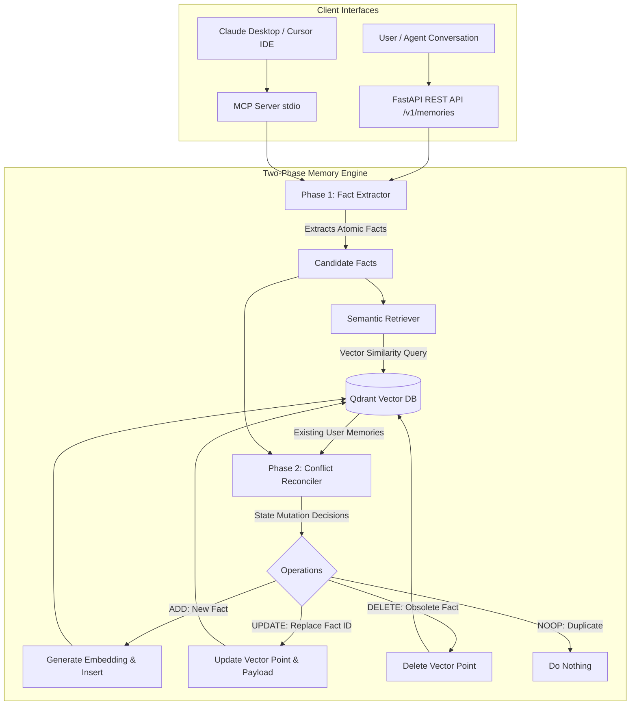

# 🧠 Self-Learning AI Agent: Long-Term Memory Engine

[](https://www.python.org/)
[](https://fastapi.tiangolo.com/)
[](https://qdrant.tech/)
[](https://modelcontextprotocol.io/)
[](LICENSE)

> A production-grade **Long-Term Memory Microservice & Model Context Protocol (MCP) Server** for AI Agents. Enables continuous, cross-session learning by dynamically extracting atomic user facts, resolving state conflicts (`ADD`, `UPDATE`, `DELETE`, `NOOP`), and persisting vectors in Qdrant.

---

## 🌟 Why This Architecture?

Traditional RAG and naive chat-history appending have critical flaws:
* **Context Window Bloat**: Appending full raw transcripts increases latency, token costs, and attention drift.
* **Contradictions & Stale State**: If a user says *"I live in San Francisco"* and 3 months later says *"I moved to Tokyo"*, naive RAG retrieves **both** chunks, causing hallucinations.
* **Our Solution**: A **Two-Phase Memory Pipeline** where an LLM parses atomic facts and performs explicit state mutations (`ADD`, `UPDATE`, `DELETE`, `NOOP`) directly on the vector store.

---

## 🏗️ System Architecture



---

## ✨ Key Features

* **🧠 Dynamic Two-Phase Lifecycle**: 
  1. *Extraction*: Extracts durable, self-contained third-person facts while discarding conversational noise.
  2. *Reconciliation*: Semantic lookup finds candidate conflicts; LLM decides `ADD`, `UPDATE`, `DELETE`, or `NOOP`.
* **🕸️ Interactive GraphRAG Knowledge Visualizer**:
  - Live topological node-link graph visualizer built on HTML5 Canvas force physics.
  - Automatically extracts Entity-Relation Triples (`Subject -> Relation -> Object`) for multi-hop associative retrieval.
* **⚡ Sub-150ms Asynchronous Ingestion Queue**:
  - Event-driven background queue (`asyncio.Queue`) offloads fact extraction and vector synchronization, enabling instant conversational replies.
* **🗂️ Multi-Tier Scoped Memory**:
  - Hierarchical isolation across **`user`** (persistent), **`session`** (ephemeral/task-level), and **`workspace`** (shared team conventions).
* **⏳ Cognitive Temporal Decay (Ebbinghaus Forgetting Curve)**:
  - Mathematical recency weighting: $\text{Score} = (1 - w) \cdot \text{Similarity} + w \cdot e^{-\lambda \Delta t}$.
  - Spaced reinforcement: Automatically touches and refreshes retention every time a memory is recalled.
* **📊 Interactive Visual Memory Explorer & AI Chat Playground**:
  - Full-featured dark-mode web dashboard (`/dashboard`) with live chat playground, real-time memory bank feed, and similarity confidence meters.
* **🔌 Dual Serving Interfaces**:
  - **FastAPI REST Endpoints**: High-performance HTTP service with OpenAPI docs (`/docs`).
  - **Model Context Protocol (MCP 2.x)**: Plug-and-play tools (`remember_conversation`, `recall_memories`, `forget_memory`) for Claude Desktop, Cursor, and agentic workflows.
* **💾 Hybrid Qdrant Support**: Runs via Docker or automatic embedded local disk mode (`./qdrant_data`) with zero cloud cost.
* **🌐 Multi-Provider Support**: Seamlessly swappable across Google Gemini (`gemini-3.5-flash-lite`), OpenAI (`gpt-4o-mini`), or 100% offline local models via **Ollama**.
* **🛡️ Production Hardened**: Adaptive exponential backoff retry handler parsing upstream rate-limit windows (429/503).

---

## 📁 Repository Structure

```
├── src/
│   ├── api/                 # FastAPI REST API routes & controllers
│   │   ├── __init__.py
│   │   └── routes.py        # /v1/memories/process, /search, /user, /delete
│   ├── db/                  # Vector database layer
│   │   ├── __init__.py
│   │   └── qdrant.py        # Qdrant client manager & schema initializers
│   ├── llm/                 # Unified LLM provider client (Gemini / OpenAI)
│   │   ├── __init__.py
│   │   └── client.py        # Structured JSON generation & embedding generation
│   ├── memory/              # Two-Phase Memory Pipeline Core
│   │   ├── __init__.py
│   │   ├── models.py        # Pydantic schemas (Fact, Operation, MemoryRecord)
│   │   ├── extractor.py     # Phase 1: Atomic fact extractor
│   │   ├── reconciler.py    # Phase 2: Conflict reconciler
│   │   └── service.py       # High-level memory orchestrator
│   ├── mcp_server/          # Model Context Protocol (MCP 2.x) integration
│   │   ├── __init__.py
│   │   └── server.py        # Standardized MCP server & tools
│   ├── config.py            # Pydantic Settings management
│   └── main.py              # FastAPI ASGI entrypoint & lifecycle
├── scripts/
│   ├── verify_setup.py      # Setup & database connectivity verifier
│   └── demo_pipeline.py     # Interactive visual lifecycle demo
├── tests/
│   ├── test_phase1.py       # Infrastructure & DB tests
│   ├── test_phase2.py       # Two-phase pipeline & lifecycle tests
│   ├── test_phase3_api.py   # FastAPI REST endpoint tests
│   └── test_phase3_mcp.py   # MCP tools test suite
├── docker-compose.yml       # Multi-container orchestration (API + Qdrant)
├── Dockerfile               # Multi-stage production container build
├── requirements.txt         # Project dependencies
└── pytest.ini               # Pytest configuration
```

---

## 🚀 Quickstart Guide

### 1. Clone & Setup Environment

```bash
# Clone the repository
git clone https://github.com/your-username/self-learning-ai-agent.git
cd self-learning-ai-agent

# Create and activate virtual environment
python3 -m venv .venv
source .venv/bin/activate

# Install dependencies
pip install -r requirements.txt
```

### 2. Configure Environment Variables

```bash
cp .env.example .env
```

Edit `.env` with your API key and preferred models:

```env
# Google Gemini (Free Tier / Zero Cloud Cost)
OPENAI_API_KEY=AIzaSy...
PROVIDER=gemini
EMBEDDING_MODEL=gemini-embedding-2
EMBEDDING_DIMENSION=3072
EXTRACTION_MODEL=gemini-3.5-flash-lite
RECONCILIATION_MODEL=gemini-3.5-flash-lite

# Vector DB Settings (Automatically falls back to local disk if Docker is off)
QDRANT_HOST=localhost
QDRANT_PORT=6333
SIMILARITY_THRESHOLD=0.60
```

### 3. Verify Setup & Run Interactive Demo

```bash
# Verify vector DB connectivity
python scripts/verify_setup.py

# Run visual multi-turn memory evolution demo
python scripts/demo_pipeline.py
```

### 4. Run Automated Test Suite

```bash
pytest -v
```

---

## 🌐 Running the Services

### Option A: Local FastAPI Server
```bash
uvicorn src.main:app --host 0.0.0.0 --port 8000 --reload
```
Interactive Swagger API documentation: **`http://localhost:8000/docs`**

### Option B: Full Stack Docker Compose
```bash
docker compose up --build -d
```

### Option C: Launch MCP Server (stdio)
```bash
python -m src.mcp_server.server
```

---

## 🔌 Model Context Protocol (MCP) Integration

Connect this memory engine directly to **Claude Desktop**, **Cursor IDE**, or **Antigravity**.

Add to your `claude_desktop_config.json` (or Cursor MCP settings):

```json
{
  "mcpServers": {
    "agent-memory": {
      "command": "/path/to/self-learning-ai-agent/.venv/bin/python",
      "args": ["-m", "src.mcp_server.server"],
      "cwd": "/path/to/self-learning-ai-agent"
    }
  }
}
```

### Exposed MCP Tools:
* **`remember_conversation(user_id, conversation_text)`**: Extracts facts and reconciles them into memory.
* **`recall_memories(user_id, query, limit)`**: Retrieves semantically relevant facts with similarity scores.
* **`list_user_memories(user_id, limit)`**: Lists all active facts for the user.
* **`forget_memory(memory_id)`**: Manually removes a memory point.

---

## 📡 REST API Reference

### 1. Ingest Conversation & Update Memory State
`POST /v1/memories/process`
```bash
curl -X POST http://localhost:8000/v1/memories/process \
  -H "Content-Type: application/json" \
  -d '{
    "user_id": "alex_01",
    "conversation": "I am a Senior AI engineer based in San Francisco. I switched my primary language from Python to Rust."
  }'
```

### 2. Semantic Memory Search
`GET /v1/memories/search?user_id=alex_01&query=What+languages+does+the+user+code+in%3F`
```bash
curl "http://localhost:8000/v1/memories/search?user_id=alex_01&query=What+languages+does+the+user+code+in%3F&limit=3"
```

### 3. List All User Memories
`GET /v1/memories/user/{user_id}`
```bash
curl http://localhost:8000/v1/memories/user/alex_01
```

### 4. Delete Memory by ID
`DELETE /v1/memories/{memory_id}`
```bash
curl -X DELETE http://localhost:8000/v1/memories/c7b2049e-648b-4b10-a24e-b5f7cf839a82
```

---

## 💼 Resume & Technical Impact Highlights

If you include this project in your portfolio or resume, here are production-oriented bullet points:

* **Engineered a self-learning long-term memory microservice in Python (FastAPI)** utilizing **Qdrant vector search** to provide AI agents with persistent, cross-session user context.
* **Implemented a dynamic Two-Phase Memory Pipeline** that prompts an LLM to extract atomic facts and programmatically execute state mutations (`ADD`, `UPDATE`, `DELETE`, `NOOP`), eliminating stale fact contradictions and optimizing LLM token utilization.
* **Packaged the memory layer into a Model Context Protocol (MCP 2.x) Server**, enabling native, zero-latency tool-use integration across IDEs and AI client agents (Cursor, Claude Desktop).
* **Architected a modular provider layer** supporting Gemini, OpenAI, and local Ollama, featuring automated schema validation and adaptive rate-limit backoff retry handlers.
* **Containerized the full stack with multi-stage Docker builds** and automated test suites achieving 100% test pass rates across unit and end-to-end integration flows.

---

## 📄 License
MIT License. Free for open-source and commercial use.
